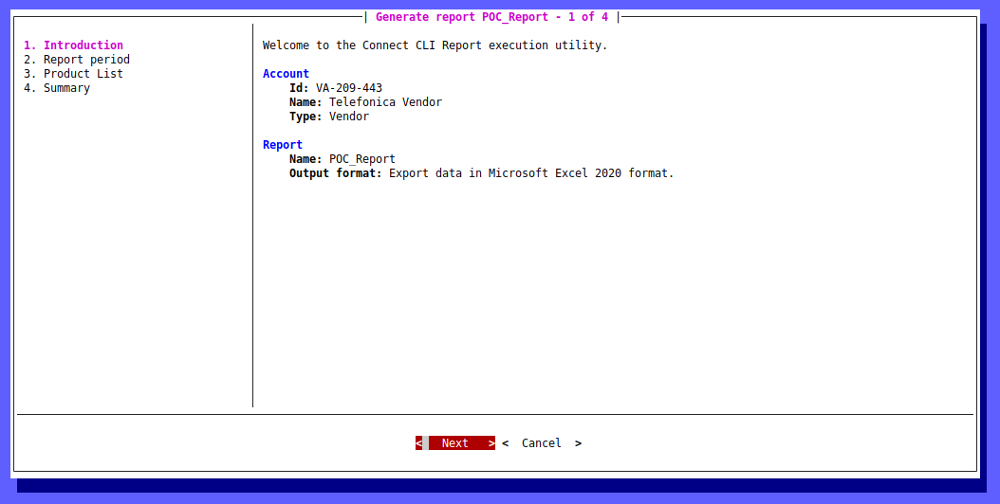
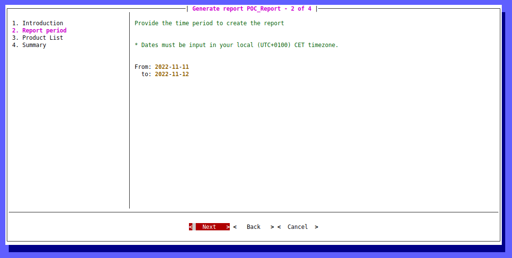
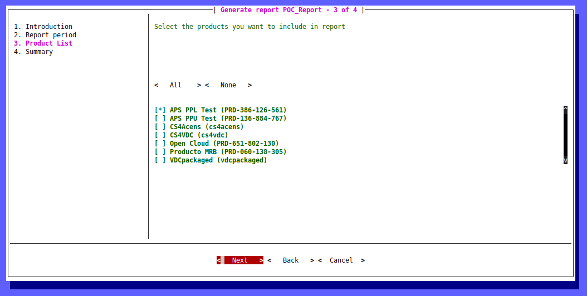
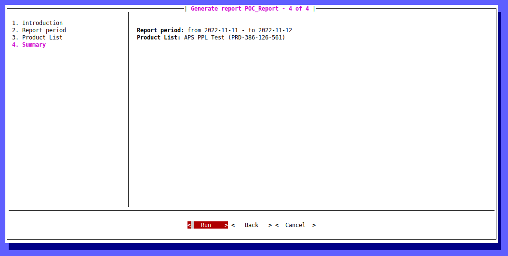

# devi-connect-reports
This repository contains all CloudBlue Connect Reports for Devi

## 1. Report templates list

* POC report
This report can be used as template to create other reports. It only filters by date and returns Id and Asset Id.

## 2. Report templates development

Report templates are configured and developed creating or editing several files.

Custom report templates can be generated using [Cookiecutter for CloudBlue Connect Reports](https://github.com/cloudblue/connect-report-python-boilerplate) too.

## 2.1 Reports.json file

This file contains information about all report templates. 

## 2.1.1 Parameters

This section contains all the parameters that can be used to filter data in order to generate the report.

| Type | Example | Overview |
| ------------- |-------------| -----|
| “product” | {<br />&nbsp;&nbsp;&nbsp;&nbsp;"id":"product",<br />&nbsp;&nbsp;&nbsp;&nbsp;"type":"product",<br />&nbsp;&nbsp;&nbsp;&nbsp;"name":"Product list",<br />&nbsp;&nbsp;&nbsp;&nbsp;"required":true,<br />&nbsp;&nbsp;&nbsp;&nbsp;"description":"Select the products you want to include in report"<br />} | This parameter type represents your product list. Use the provided example to include specified products to your report. |
| “marketplace” | {<br />&nbsp;&nbsp;&nbsp;&nbsp;"id":"mkp",<br />&nbsp;&nbsp;&nbsp;&nbsp;"type":"marketplace",<br />&nbsp;&nbsp;&nbsp;&nbsp;"name":"Marketplaces",<br />&nbsp;&nbsp;&nbsp;&nbsp;"required":true,<br />&nbsp;&nbsp;&nbsp;&nbsp;"description":"Select the marketplaces you want to include in report"} | This parameter type defines your marketplaces. Include specified marketplaces to your report by using this example. |
| "hub" | {<br />&nbsp;&nbsp;&nbsp;&nbsp;"id":"hub",<br />&nbsp;&nbsp;&nbsp;&nbsp;"type":"hub",<br />&nbsp;&nbsp;&nbsp;&nbsp;"name":"Hubs",<br />&nbsp;&nbsp;&nbsp;&nbsp;"required":true,<br />&nbsp;&nbsp;&nbsp;&nbsp;"description":"Select the hubs you want to include in report"} | This parameter type represents your hub list. Include selected hubs by using the provided example. |
| "date_range" | {<br />&nbsp;&nbsp;&nbsp;&nbsp;"id":"date",<br />&nbsp;&nbsp;&nbsp;&nbsp;"type":"date_range",<br />&nbsp;&nbsp;&nbsp;&nbsp;"name":"Report period",<br />&nbsp;&nbsp;&nbsp;&nbsp;"description":"Provide the time period to create the report",<br />&nbsp;&nbsp;&nbsp;&nbsp;"required": true} | This parameter type is used to define your report date range. Specify your start date and end date by using this parameter type. Use the provided example to include and specify your report date range. |
| "date" | {<br />&nbsp;&nbsp;&nbsp;&nbsp;"id":"date",<br />&nbsp;&nbsp;&nbsp;&nbsp;"type":"date",<br />&nbsp;&nbsp;&nbsp;&nbsp;"name":"date",<br />&nbsp;&nbsp;&nbsp;&nbsp;"required":true,<br />&nbsp;&nbsp;&nbsp;&nbsp;"description":"Select the date you want"} | This parameter type is used to specify your report date. Include a date parameter by following the provided example. |
| "object" | {<br />&nbsp;&nbsp;&nbsp;&nbsp;"id":"object",<br />&nbsp;&nbsp;&nbsp;&nbsp;"type":"object",<br />&nbsp;&nbsp;&nbsp;&nbsp;"name":"object",<br />&nbsp;&nbsp;&nbsp;&nbsp;"required":true,<br />&nbsp;&nbsp;&nbsp;&nbsp;"description":"give me a json object"} | Use this parameter type to include a JSON object. |
| "single_line" | {<br />&nbsp;&nbsp;&nbsp;&nbsp;"id":"single_line",<br />&nbsp;&nbsp;&nbsp;&nbsp;"type":"single_line",<br />&nbsp;&nbsp;&nbsp;&nbsp;"name":"Single line",<br />&nbsp;&nbsp;&nbsp;&nbsp;"required":true,<br />&nbsp;&nbsp;&nbsp;&nbsp;"description":"Tell me how you feel today in 1 sentence"} | Include a single line by using this particular parameter type. |
| "checkbox" | {<br />&nbsp;&nbsp;&nbsp;&nbsp;"id":"rr_type",<br />&nbsp;&nbsp;&nbsp;&nbsp;"type":"checkbox",<br />&nbsp;&nbsp;&nbsp;&nbsp;"name":"Types of requests",<br />&nbsp;&nbsp;&nbsp;&nbsp;"required":true,<br />&nbsp;&nbsp;&nbsp;&nbsp;"description":"Select the type of requests you want to include in report",<br />&nbsp;&nbsp;&nbsp;&nbsp;"choices":<br />&nbsp;&nbsp;&nbsp;&nbsp;[<br />&nbsp;&nbsp;&nbsp;&nbsp;&nbsp;&nbsp;&nbsp;&nbsp;{<br />&nbsp;&nbsp;&nbsp;&nbsp;&nbsp;&nbsp;&nbsp;&nbsp;&nbsp;&nbsp;&nbsp;&nbsp;"value":"setup",<br />&nbsp;&nbsp;&nbsp;&nbsp;&nbsp;&nbsp;&nbsp;&nbsp;&nbsp;&nbsp;&nbsp;&nbsp;"label":"Setup"<br />&nbsp;&nbsp;&nbsp;&nbsp;&nbsp;&nbsp;&nbsp;&nbsp;},<br />&nbsp;&nbsp;&nbsp;&nbsp;&nbsp;&nbsp;&nbsp;&nbsp;{<br />&nbsp;&nbsp;&nbsp;&nbsp;&nbsp;&nbsp;&nbsp;&nbsp;&nbsp;&nbsp;&nbsp;&nbsp;"value":"update",<br />&nbsp;&nbsp;&nbsp;&nbsp;&nbsp;&nbsp;&nbsp;&nbsp;&nbsp;&nbsp;&nbsp;&nbsp;"label":"Update"<br />&nbsp;&nbsp;&nbsp;&nbsp;&nbsp;&nbsp;&nbsp;&nbsp;}<br />&nbsp;&nbsp;&nbsp;&nbsp;]<br />} | This parameter type allows utilizing checkboxes. Thus, by using these checkboxes, you can include specific information within your report. Define your checkboxes within the choices array. <br />The provided example showcases how to include tier configuration requests and setup/update checkboxes to a report. |
| "choice" | {<br />&nbsp;&nbsp;&nbsp;&nbsp;"id":"rr_status",<br />&nbsp;&nbsp;&nbsp;&nbsp;"type":"choice",<br />&nbsp;&nbsp;&nbsp;&nbsp;"name":"Request status",<br />&nbsp;&nbsp;&nbsp;&nbsp;"description":"Select the status of the requests you want to include in report",<br />&nbsp;&nbsp;&nbsp;&nbsp;"required":true,<br />&nbsp;&nbsp;&nbsp;&nbsp;"choices":<br />&nbsp;&nbsp;&nbsp;&nbsp;[<br />&nbsp;&nbsp;&nbsp;&nbsp;&nbsp;&nbsp;&nbsp;&nbsp;{<br />&nbsp;&nbsp;&nbsp;&nbsp;&nbsp;&nbsp;&nbsp;&nbsp;&nbsp;&nbsp;&nbsp;&nbsp;"value":"tiers_setup",<br />&nbsp;&nbsp;&nbsp;&nbsp;&nbsp;&nbsp;&nbsp;&nbsp;&nbsp;&nbsp;&nbsp;&nbsp;"label":"Tier Setup"<br />&nbsp;&nbsp;&nbsp;&nbsp;&nbsp;&nbsp;&nbsp;&nbsp;},<br />&nbsp;&nbsp;&nbsp;&nbsp;&nbsp;&nbsp;&nbsp;&nbsp;{<br />&nbsp;&nbsp;&nbsp;&nbsp;&nbsp;&nbsp;&nbsp;&nbsp;&nbsp;&nbsp;&nbsp;&nbsp;"value":"inquiring",<br />&nbsp;&nbsp;&nbsp;&nbsp;&nbsp;&nbsp;&nbsp;&nbsp;&nbsp;&nbsp;&nbsp;&nbsp;"label":"Inquiring"<br />&nbsp;&nbsp;&nbsp;&nbsp;&nbsp;&nbsp;&nbsp;&nbsp;},<br />&nbsp;&nbsp;&nbsp;&nbsp;&nbsp;&nbsp;&nbsp;&nbsp;{<br />&nbsp;&nbsp;&nbsp;&nbsp;&nbsp;&nbsp;&nbsp;&nbsp;&nbsp;&nbsp;&nbsp;&nbsp;"value":"pending",<br />&nbsp;&nbsp;&nbsp;&nbsp;&nbsp;&nbsp;&nbsp;&nbsp;&nbsp;&nbsp;&nbsp;&nbsp;"label":"Pending"<br />&nbsp;&nbsp;&nbsp;&nbsp;&nbsp;&nbsp;&nbsp;&nbsp;},<br />&nbsp;&nbsp;&nbsp;&nbsp;&nbsp;&nbsp;&nbsp;&nbsp;{<br />&nbsp;&nbsp;&nbsp;&nbsp;&nbsp;&nbsp;&nbsp;&nbsp;&nbsp;&nbsp;&nbsp;&nbsp;"value":"approved",<br />&nbsp;&nbsp;&nbsp;&nbsp;&nbsp;&nbsp;&nbsp;&nbsp;&nbsp;&nbsp;&nbsp;&nbsp;"label":"Approved"<br />&nbsp;&nbsp;&nbsp;&nbsp;&nbsp;&nbsp;&nbsp;&nbsp;},<br />&nbsp;&nbsp;&nbsp;&nbsp;&nbsp;&nbsp;&nbsp;&nbsp;{<br />&nbsp;&nbsp;&nbsp;&nbsp;&nbsp;&nbsp;&nbsp;&nbsp;&nbsp;&nbsp;&nbsp;&nbsp;"value":"failed",<br />&nbsp;&nbsp;&nbsp;&nbsp;&nbsp;&nbsp;&nbsp;&nbsp;&nbsp;&nbsp;&nbsp;&nbsp;"label":"Failed"<br />&nbsp;&nbsp;&nbsp;&nbsp;&nbsp;&nbsp;&nbsp;&nbsp;}<br />&nbsp;&nbsp;&nbsp;&nbsp;]<br />} | Include specified information to your report and filter out unwanted data via this parameter type and specified choices. Define your filters within the choices array. <br />The provided example demonstrates how to include fulfillment requests and their available statuses as choices to a report. |

## 2.1.2 Renderers

Renderers define outpuf file type: xlsx, json, xml, csv or pdf

## 2.1 Entrypoint file

This python file implements parameter transformation into RQL request and data transformation from received response to file. 

## 3. Report tools

Reports can be generated using cli before tagging repository and uploading it to Connect. It requires ***Connect cli***

## Install Connect cli

To use `connect-cli` you need a system with python 3.8 or later installed.

## Linux

```sh
    $ pip install --upgrade connect-cli
```

## Mac OS

To install `connect-cli` with homebrew run:

```sh
    $ brew update
    $ brew tap cloudblue/connect
    $ brew install cloudblue/connect/connect-cli
```

## Windows 

An installer package is available for Windows 10 or newer.
You can download its zip file from the [Github Releases](https://github.com/cloudblue/connect-cli/releases) page.

## 4. Deploy and execute reports

This can be deployed over Connect or can be executed from local files.
## 4.1 Execute in development device

## 4.1.1 Configure Connect cli

## Add a new account

First of all you need to add an account the `connect-cli` with the CloudBlue Connect API *key*.

```
    $ ccli account add "ApiKey XXXXX:YYYYY"
```

## 4.1.2 Reports management

In order tu manage reports, 'ccli report' command shoud be used:
```sh
$ ccli report

Usage: ccli report [OPTIONS] COMMAND [ARGS]...

Options:
  --help  Show this message and exit.

Commands:
  execute  Execute a report.
  info     Get additional information for a given report.
  list     List available reports.
```
## List reports

## List reports uploaded to connect

```
    $ ccli report list
```

## List reports into repository

```
    $ ccli report list -d /path/to/packages/json/cotaining/folder
```

## Get information about a report

## Get information about a report uploaded to connect

```
    $ ccli report info {id}
```

## Get information about a report into repository

```
    $ ccli report info {id} -d /path/to/packages/json/cotaining/folder
```

## Execute Report

Report execution will gide you through several steps, depending on how many selections must be done to filter data:









## Execute reports uploaded to connect

```
    $ ccli report execute {id}
```

## Execute reports into repository

```
    $ ccli report execute {id} -d /path/to/packages/json/cotaining/folder
```

## 4.2 Deploy in Connect

In order to add reports to Connect, you have to make a release and tag on GitHub.

## 4.2.1 Adding a repository

Note that this step need to be done only once.

Steps:
- Access to Devi connect site and navigate to [Account > Reports > Repositories].
- Press the link `ADD REPOSITORY` to add this repository.
- Fill the form:
  - Git Repository URL: https://github.com/TelefonicaTC2Tech/devi-connect-reports
  - Enable `Requires authorization` because the git repository is private:
    - Username: Add the username
    - Personal Access Token: Add the personal access token with read permissions for this repository.
- Press next and choose the tag
- Complete the wizard.

## 4.2.2 Editing a repository

Steps:

- Access to Devi connect site and navigate to [Account > Reports > Repositories].
- Press the edit button (pencil icon) to edit one of the repositories of the list.
- Complete the form as indicated in `Adding a repository` section.

## 4.2.3 Create a report

Steps:

- Access to Devi connect site and navigate to [Reports].
- Press the link `CREATE REPORT`.
- Select one of the templates of this repository. 
- Complete the wizard specific for the selected template.
